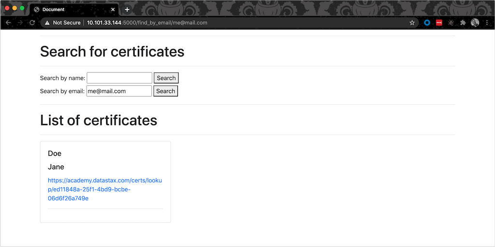

# DataStax Academy Certificate Lookup POC
In July 2020, the [**DataStax Academy**](https://academy.datastax.com) site migrated to a new learning management system (LMS). The LMS however is not capable of hosting the certificates of the DBAs and developers who have successfully passed the Apache Cassandra™ 3 exam.

This app is a proof-of-concept attempt at providing a mechanism for certified users to be able to download a copy of their certificates.

## App screenshots
Certificate lookup by email:



Certificate lookup by last name:


## Getting started

This is for Python 3.6 and newer. We recommend running this in a virtual python environment.

**Step 1** - Install dependencies:

```
pip install flask
pip install requests
```

In bare Ubuntu builds, manually install the Flask package:

```
sudo apt-get update
sudo apt install python3-flask
```

**Step 2** - Set the following environment variables on your machine:

```
export FLASK_APP=app.py
export ASTRA_DB_USERNAME=your_db_user
export ASTRA_DB_PASSWORD=your_db_password
export ASTRA_DB_ID=your_cluster_id
export ASTRA_DB_REGION=your_cluster_region
export ASTRA_DB_KEYSPACE=your_keyspace_name
```

**Step 3** - Either clone the repo on your machine or download the latest release and unpack it.

**Step 4** - Logon to your Astra DB and create the schema using `schema.cql`.

**Step 5** - Since this is a lookup app, bulk load data into the tables using the sample data with DSBulk.

## Running the app

**Option 1** - To run locally:

```
cd path/to/dsa-certs
flask run
```

**Option 2** - To run on a server, specify the public IP to bind to:

```
cd path/to/dsa-certs
flask run --host <public_ip>
```

Here is an example output:

```
075ded31-06aa-4ba6-a73e-9c59b26e6970
 * Serving Flask app "app"
 * Running on http://10.101.33.144:5000/ (Press CTRL+C to quit)
```

The first line is the Astra auth token which indicates that auth is successful. Note that the token has a 30-minute lifetime from last use so if the app hasn't been used in a while, the token will expire and will require a restart.

Navigate to http://localhost:5000/hello (or http://host_ip:5000/hello). Search for certificates by last name or email address (based on the sample data).

## TODO

Add a search form for search by first name

build docker file and test container

## Acknowledgements

Thanks Erick for all the ground work, and thanks Denise for the Python example which was very helpful.

## Authors
[Bettina Swynnerton](https://github.com/bettinaswynnerton) and [Erick Ramirez](https://github.com/flightc).
